# PMN (TPAMI)

This work is based on our preliminary work "[Learnability Enhancement for Low-light Raw Denoising: Where Paired Real Data Meets Noise Modeling](https://github.com/megvii-research/PMN)" in ACMMM 2022.  
The checkpoints and resources are too large, so we put them on the [Baidu Netdisk](https://pan.baidu.com/s/1YIY_bmrdK5SLfrHBQjWfRA?pwd=vmcl).

## 📋 TODO LIST

[x] Checkout the main branch to TPAMI branch.  
[x] Cleanup & update the code for the public datasets.  
[] Cleanup & update the code for our datasets.  
[] Test the the code for evaluation.  
[] Test the the code for training.  

## ✨ Highlights
1. We light the idea of **learnability enhancement** for low-light raw image denoising by reforming paired real data according to the noise modeling from a data perspective.
<div align=center>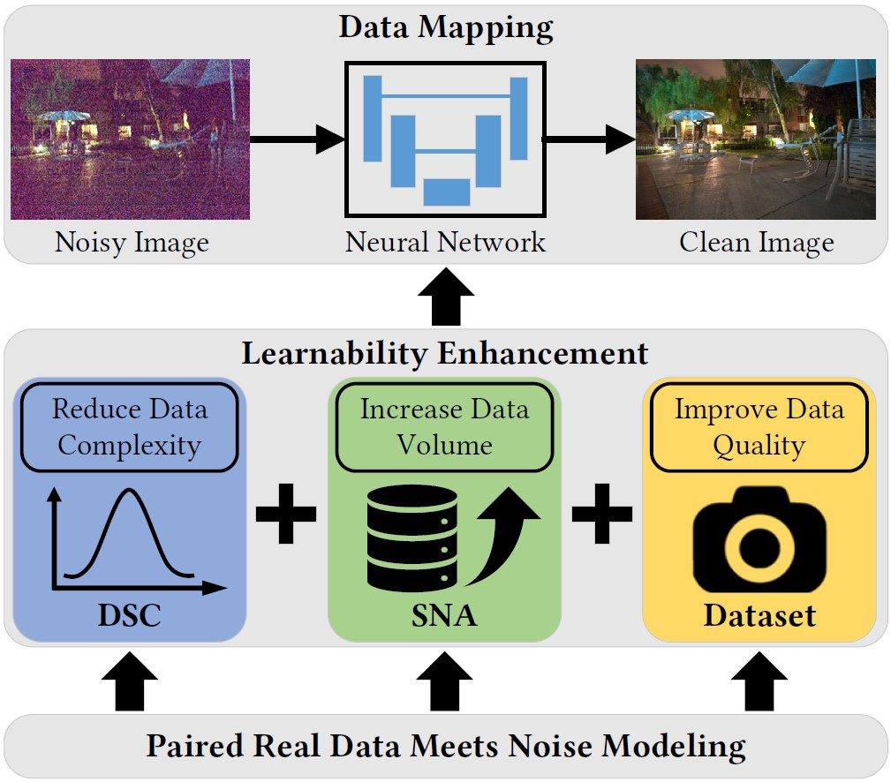</div>

2. We increase the data volume of paired real data with a novel **Shot Noise Augmentation (SNA)** method, which promotes the precision of data mapping by data augmentation.
<div align=center>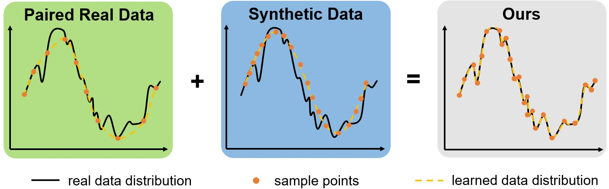</div>

3. We reduce the noise complexity with a novel **Dark Shading Correction (DSC)** method, which promotes the accuracy of data mapping by noise decoupling.
<div align=center>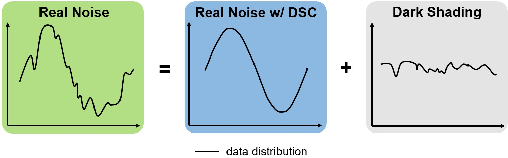</div>

4. We develop a high-quality **image acquisition protocol** and build a **Low-light Raw Image Denoising (LRID) dataset**, which promotes the reliability of data mapping by improving the data quality of paired real data.
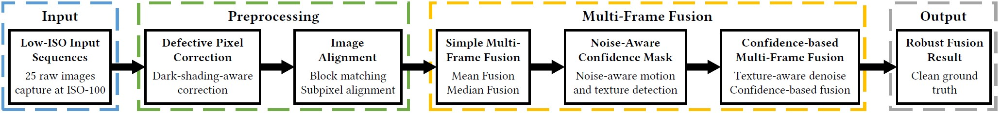
<div align=center>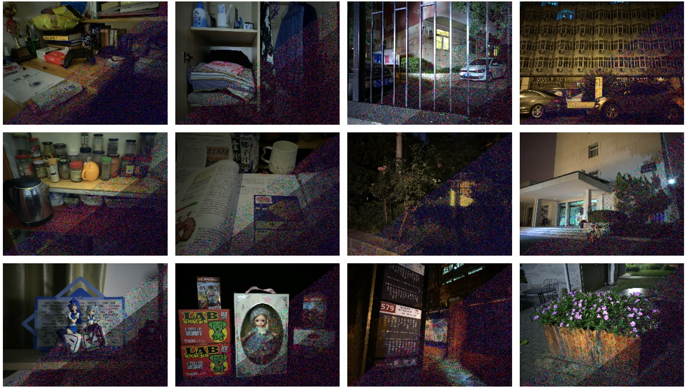</div>


5. We demonstrate the superior performance of our methods on public datasets and our dataset in both quantitative results and visual quality.

## 📋 Prerequisites
* Python >=3.6, PyTorch >= 1.6
* Requirements: opencv-python, rawpy, exifread, h5py, scipy
* Platforms: Ubuntu 16.04, cuda-10.1
* Our method can run on the CPU, but we recommend you run it on the GPU

Please download the ELD dataset and SID dataset first, which are necessary for validation (or training).   
ELD ([official project](https://github.com/Vandermode/ELD)): [download (11.46 GB)](https://drive.google.com/file/d/13Ge6-FY9RMPrvGiPvw7O4KS3LNfUXqEX/view?usp=sharing)  
SID ([official project](https://github.com/cchen156/Learning-to-See-in-the-Dark)):  [download (25 GB)](https://storage.googleapis.com/isl-datasets/SID/Sony.zip)

## 🎬 Quick Start
1. use `get_dataset_infos.py` to generate dataset infos
```bash 
# Evaluate
python3 get_dataset_infos.py --dstname ELD --root_dir /data/ELD --mode SonyA7S2
python3 get_dataset_infos.py --dstname SID --root_dir /data/SID/Sony --mode evaltest
# Train
python3 get_dataset_infos.py --dstname SID --root_dir /data/SID/Sony --mode train
```
2. evaluate

If you don't want to save pictures, please add ```--save_plot False```. This option will save your time and space.
```bash 
# ELD & SID
python3 trainer_SID.py -f runfiles/Ours.yml --mode evaltest
# ELD only
python3 trainer_SID.py -f runfiles/Ours.yml --mode eval
# SID only
python3 trainer_SID.py -f runfiles/Ours.yml --mode test
```
3. train
```bash 
python3 trainer_SID.py -f runfiles/Ours.yml --mode train
```

## 🔍 Code Guidelines
#### SNA
The parameter sampling of SNA is implemented as the `raw_wb_aug_torch` function in the file ```data_process/process.py```.
The complete process of SNA has the CPU version in the `Mix_Dataset` class in ```data_process/real_datasets.py``` and the GPU version in the `preprocess` function in ```trainer_SID.py```.
#### DSC
Both dark shading calibration and noise calibration require massive dark frames. We provide the calibration results directly. The calibration results for dark shading are stored in the `resources` folder.  
The raw noise parameters at each ISO are stored in the `get_camera_noisy_params_max` function in `process.py`, which can be used to calibrate the noise parameters based on a noise model (P-G or ELD).  

**HINT: The calibration is based on a SonyA7S2 camera, which has the same sensor as the public datasets but not the same camera.**

## 📄 Results

### Comparision

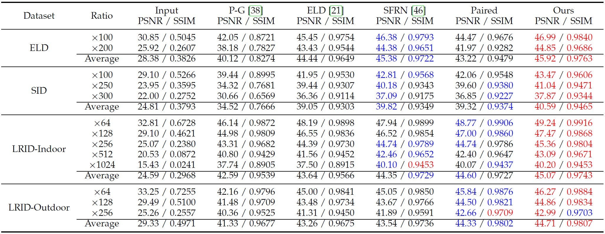
Note: 
* The quantitative results on the SID dataset is different from the provided results in ELD (TPAMI) because only the central area is compared in ELD (TPAMI) on the SID dataset.  
* We developed the implementation of SFRN and increased the number of dark frames, so its performance is much better than that in our preliminary version.

<details>
<summary>Visual Comparision</summary>

#### ELD
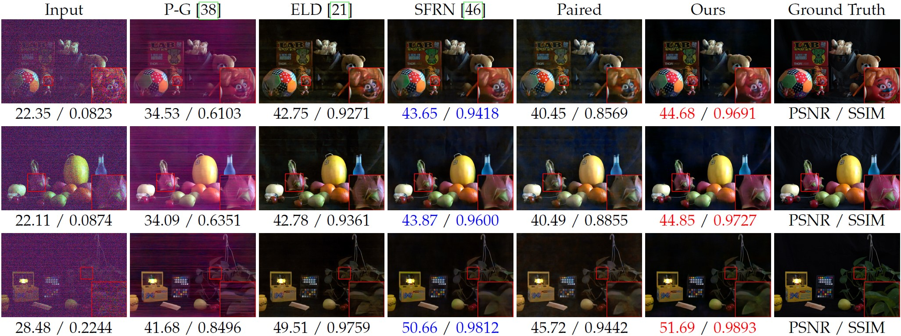
#### SID
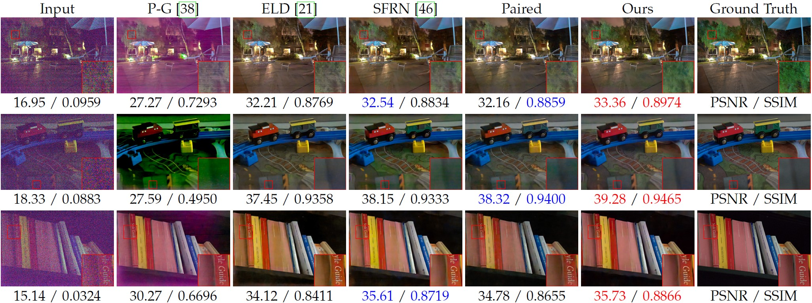
#### Ours (LRID)
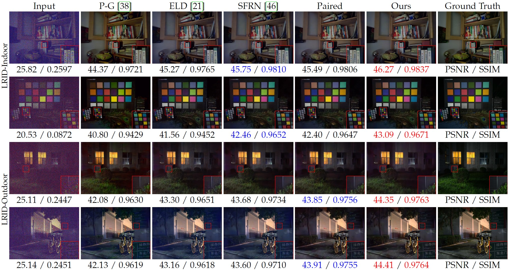
</details>

### Ablation Study
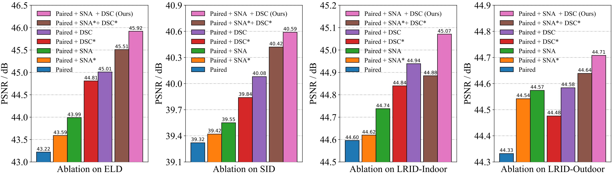
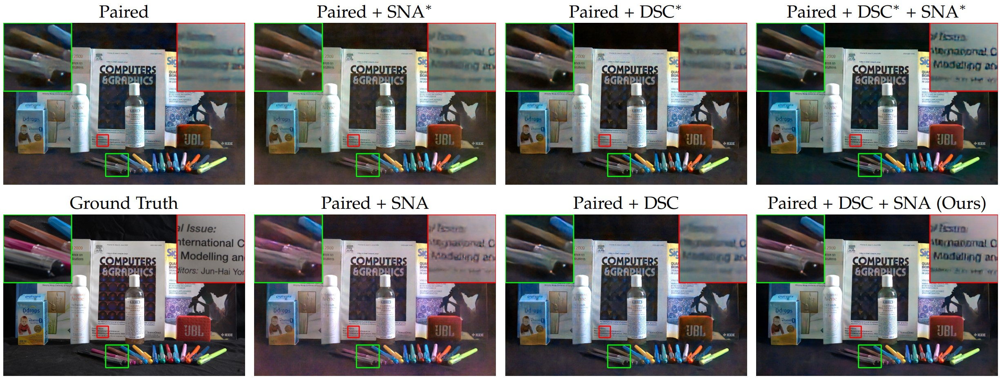

## 🏷️ Citation
If you find our code helpful in your research or work please cite our paper.
```bibtex
@inproceedings{feng2022learnability,
    author = {Feng, Hansen and Wang, Lizhi and Wang, Yuzhi and Huang, Hua},
    title = {Learnability Enhancement for Low-Light Raw Denoising: Where Paired Real Data Meets Noise Modeling},
    booktitle = {Proceedings of the 30th ACM International Conference on Multimedia},
    year = {2022},
    pages = {1436–1444},
    numpages = {9},
    location = {Lisboa, Portugal},
    series = {MM '22}
}
```

## 🤝 Acknowledgments
* [SID (CVPR 2018)](https://github.com/cchen156/Learning-to-See-in-the-Dark)
* [ELD (CVPR 2020 / TPAMI 2021)](https://github.com/Vandermode/ELD)
* [SFRN (ICCV 2021)](https://github.com/zhangyi-3/noise-synthesis)

## 📧 Contact
If you would like to get in-depth help from me, please feel free to contact me (fenghansen@bit.edu.cn / hansen97@outlook.com) with a brief self-introduction (including your name, affiliation, and position).
