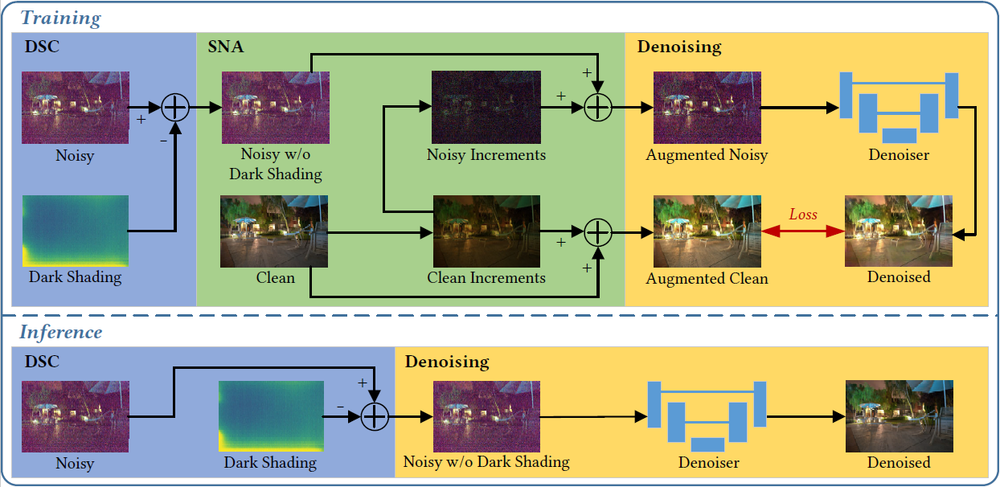
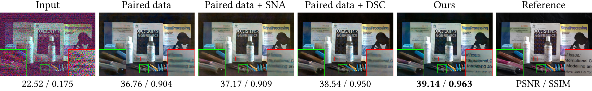

# PMN (Paired real data Meet Noise model)

The official implementation of ACMMM 2022 paper "[Learnability Enhancement for Low-light Raw Denoising: Where Paired Real Data Meets Noise Modeling](https://arxiv.org/abs/2207.06103)"  
Interested readers are also referred to our official [Note](https://zhuanlan.zhihu.com/p/544592330) about this work in Zhihu (Chinese).

## ✨ Highlights

* We present a learnability enhancement strategy to reform paired real data according to noise modeling. Our strategy consists of two efficient techniques: shot noise augmentation (SNA) and dark shading correction (DSC). 
* SNA improves the precision of data mapping by increasing the data volume. Benefiting from the increased data volume, the mapping can promote the denoised images with clear texture.
* DSC reduces the complexity of data mapping by reducing the noise complexity. Benefiting from the reduced noise complexity, the mapping can promote the denoised images with exact colors.




## 📋 Prerequisites
* Python >=3.6, PyTorch >= 1.6
* Requirements: opencv-python, rawpy, exifread, h5py, scipy
* Platforms: Ubuntu 16.04, cuda-10.1
* Our method can run on the CPU, but we recommend you run it on the GPU

Please download the ELD dataset and SID dataset first, which are necessary for validation (or training).   
ELD ([official project](https://github.com/Vandermode/ELD)): [download (11.46 GB)](https://drive.google.com/file/d/13Ge6-FY9RMPrvGiPvw7O4KS3LNfUXqEX/view?usp=sharing)  
SID ([official project](https://github.com/cchen156/Learning-to-See-in-the-Dark)):  [download (25 GB)](https://storage.googleapis.com/isl-datasets/SID/Sony.zip)

## 🎬 Quick Start
1. use `get_dataset_infos.py` to generate dataset infos
```bash 
# Evaluate
python3 get_dataset_infos.py --dstname ELD --root_dir /data/ELD --mode SonyA7S2
python3 get_dataset_infos.py --dstname SID --root_dir /data/SID/Sony --mode evaltest
# Train
python3 get_dataset_infos.py --dstname SID --root_dir /data/SID/Sony --mode train
```
2. evaluate
```bash 
# If you don't want to save pictures, please add '--save_plot False'. This option will save your time and space.
# ELD & SID
python3 trainer_SID.py -f runfiles/Ours.yml --mode evaltest
# ELD only
python3 trainer_SID.py -f runfiles/Ours.yml --mode eval
# SID only
python3 trainer_SID.py -f runfiles/Ours.yml --mode test
```
3. train
```bash 
python3 trainer_SID.py -f runfiles/Ours.yml --mode train
```

## 🔍 Code Guidelines
#### SNA
The parameter sampling of SNA is implemented as the `raw_wb_aug_torch` function in the file ```data_process/process.py```.
The complete process of SNA has the CPU version in the `Mix_Dataset` class in ```data_process/real_datasets.py``` and the GPU version in the `preprocess` function in ```trainer_SID.py```.
#### DSC
Both dark shading calibration and noise calibration require massive dark frames. We provide the calibration results directly. The calibration results for dark shading are stored in the `resources` folder.  
The raw noise parameters at each ISO are stored in the `get_camera_noisy_params_max` function in `process.py`, which can be used to calibrate the noise parameters based on a noise model (P-G or ELD).  

**HINT: The calibration is based on a SonyA7S2 camera, which has the same sensor as the public datasets but not the same camera.**

## 📄 Results

| Dataset | Ratio | Index | P-G   | ELD   | SFRN  | Paired      | Ours  |
|---------|-------|-------|-------|-------|-------|-------------|-------|
| ELD     | ×100  | PSNR  | 42.05 | 45.45 | 46.02 | 44.47       | 46.50  |
|         |       | SSIM  | 0.872 | 0.975 | 0.977 | 0.968       | 0.985 |
|         | ×200  | PSNR  | 38.18 | 43.43 | 44.10 | 41.97       | 44.51 |
|         |       | SSIM  | 0.782 | 0.954 | 0.964 | 0.928       | 0.973 |
| SID     | ×100  | PSNR  | 39.44 | 41.95 | 42.29 | 42.06       | 43.16 |
|         |       | SSIM  | 0.890 | 0.963 | 0.951 | 0.955       | 0.960  |
|         | ×250  | PSNR  | 34.32 | 39.44 | 40.22 | 39.60       | 40.92 |
|         |       | SSIM  | 0.768 | 0.931 | 0.938 | 0.938       | 0.947 |
|         | ×300  | PSNR  | 30.66 | 36.36 | 36.87 | 36.85       | 37.77 |
|         |       | SSIM  | 0.657 | 0.911 | 0.917 | 0.923       | 0.934 |

Note: The quantitative results on the SID dataset is different from the provided results in ELD(TPAMI) because only the central area is compared in ELD(TPAMI) on the SID dataset.

<details>
<summary>w/o brighteness alignment provided by ELD</summary>

| Dataset | Ratio | Index | P-G   | ELD   | SFRN  | Paired | Ours  |
|---------|-------|-------|-------|-------|-------|-------------|-------|
| ELD     | ×100  | PSNR  | 39.44 | 45.06 | 45.47 | 43.80       | 45.94 |
|         |       | SSIM  | 0.780 | 0.975 | 0.976 | 0.963       | 0.984 |
|         | ×200  | PSNR  | 33.76 | 43.21 | 43.65 | 41.54       | 44.00 |
|         |       | SSIM  | 0.609 | 0.954 | 0.962 | 0.918       | 0.968 |
| SID     | ×100  | PSNR  | 37.50 | 41.21 | 41.38 | 41.39       | 42.65 |
|         |       | SSIM  | 0.856 | 0.952 | 0.949 | 0.954       | 0.959 |
|         | ×250  | PSNR  | 31.67 | 38.54 | 39.48 | 38.90       | 40.39 |
|         |       | SSIM  | 0.765 | 0.929 | 0.937 | 0.937       | 0.946 |
|         | ×300  | PSNR  | 28.53 | 35.35 | 35.96 | 36.55       | 37.23 |
|         |       | SSIM  | 0.667 | 0.908 | 0.915 | 0.922       | 0.933 |

</details>

## 🏷️ Citation
If you find our code helpful in your research or work please cite our paper.
```bibtex
@inproceedings{feng2021learnability,
    title={Learnability Enhancement for Low-light Raw Denoising: Where Paired Real Data Meets Noise Modeling},
    author={Feng, Hansen and Wang, Lizhi and Wang, Yuzhi and Huang, Hua},
    booktitle={Proceedings of the 30th ACM International Conference on Multimedia},
    year={2022}
}
```

## 🤝 Acknowledgments
* [SID (CVPR 2018)](https://github.com/cchen156/Learning-to-See-in-the-Dark)
* [ELD (CVPR 2020 / TPAMI 2021)](https://github.com/Vandermode/ELD)
* [SFRN (ICCV 2021)](https://github.com/zhangyi-3/noise-synthesis)
